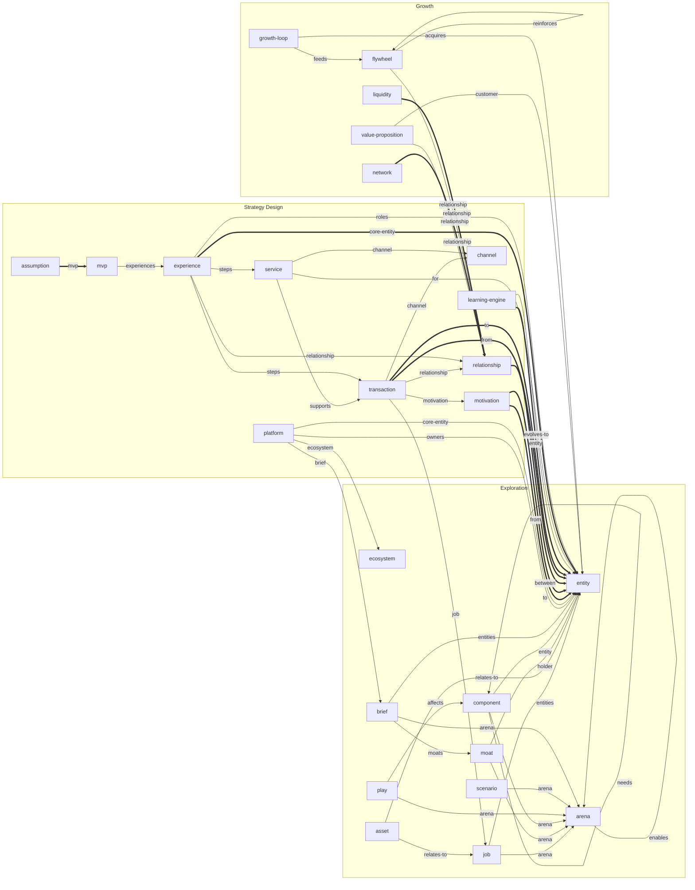

# The pdt42 meta-model

<!-- Generated from packages/core/src/schemas.ts by `pnpm docs:meta-model`. Do not edit by hand. -->

Block types as nodes, reference fields as edges. Thick arrows are required references; every
other reference is optional — but when it is set, it must point to an existing element of the
named type (rule E002). `*` marks required attributes; every block also has `id` and, where it
makes sense, `title`.

## Exploration

### `ecosystem` (E1)

The broad context of interactions you explore — the starting point of the whole design. At most one per workspace.

| Attribute | Kind | Meaning |
| --------- | ---- | ------- |
| `context` | ecosystem-mobilization · product-service-innovation | Why you look at this ecosystem: mobilising an ecosystem that under-performs, or taking an existing offering up the value chain |

### `arena` (E1)

A cluster of systemic jobs-to-be-done inside the ecosystem, reached by roughly ten entities together.

| Attribute | Kind | Meaning |
| --------- | ---- | ------- |
| `outcome` | text | The systemic outcome the entities in this arena reach together |
| `after` | → arena (many) | Arenas that come before this one (sequence: before → after) |
| `enables` | → arena (many) | Arenas this one enables (layer: enabling → enabled) |
| `focus` | yes · no | In your FOCUS area: an arena you can act on, not necessarily the most important one |
| `steps` | list | Steps of the systemic interaction — the experiences to scan next |

### `job` (E2)

An experience that already happens in the ecosystem — a step of an arena, placed on the Ecosystem Scan.

| Attribute | Kind | Meaning |
| --------- | ---- | ------- |
| `arena` | → arena | The arena whose step this is |
| `entities` | → entity (many) | The entities that take part |
| `job-step` | define · locate · prepare · confirm · execute · monitor · modify · conclude | Where it sits in the universal job map |

### `entity` (E2)

An entity-role: a cluster of similar ecosystem actors, with its platform role and its portrait.

| Attribute | Kind | Meaning |
| --------- | ---- | ------- |
| `role` | owner · stakeholder · peer-consumer · peer-producer · partner | The platform role this entity-role plays |
| `layer` | long-tail · aggregator · infrastructure | Where it sits on the Ecosystem Scan: long-tail niche, aggregator/mediator, or infrastructure |
| `type` | text | What kind of entity it is: individuals, SMBs, institutions … |
| `clusters` | list | The concrete entities clustered into this role (a GP and a nurse → healthcare professionals) |
| `context` | list | Its environment, tools, constraints and daily reality |
| `assets` | list | Potential: assets it owns and could leverage |
| `capabilities` | list | Potential: capabilities it could leverage |
| `potential` | list | Potential: how it could grow or evolve |
| `goals` | list | Compressor: what it is trying to achieve right now |
| `pressures` | list | Compressor: the performance pressures pushing it to improve |
| `convenience-gains` | list | Gains sought: easier, faster, cheaper ways of doing things |
| `reach-gains` | list | Gains sought: access and reach — its 'other half of the apple' |
| `value-gains` | list | Gains sought: money, savings, recognition, knowledge, security … |

### `asset` (E3)

An asset or capability of the shaping organisation that could ground an advantage.

| Attribute | Kind | Meaning |
| --------- | ---- | ------- |
| `vrio` * | v · vr · vri · vrio | How far it passes the ordered VRIO test: Valuable, Rare, Inimitable, Organised |
| `layer` | long-tail · aggregator · infrastructure | The market layer the asset plays at |
| `relates-to` | → entity \| job (many) | The entities or experiences it is positioned next to on the Ecosystem Scan |

### `moat` (E3)

A dominant position in the ecosystem: an established aggregator or a regulated, permissioned player.

| Attribute | Kind | Meaning |
| --------- | ---- | ------- |
| `kind` * | demand-aggregator · supply-aggregator · regulated · other | What makes it hard to displace |
| `holder` | → entity | The entity that holds the moat |
| `layer` | long-tail · aggregator · infrastructure | The market layer of the moat |
| `arena` | → arena | The arena it dominates |

### `component` (E5)

A node of the arena's value chain on the Wardley Map: positioned by visibility and evolution.

| Attribute | Kind | Meaning |
| --------- | ---- | ------- |
| `arena` | → arena | The arena whose value chain this component belongs to |
| `visibility` | number | Visibility towards the user, 0 (invisible) to 100 (the user need itself) |
| `evolution` | genesis · custom · product · commodity | Evolution today: genesis, custom, product or commodity |
| `target` | genesis · custom · product · commodity | Evolution after the platform plays (to-be value chain) |
| `needs` | → component (many) | Components this one depends on (lower in the chain) |
| `entity` | → entity | The entity this component stands for, if any |

### `play` (E6)

The application of one Platform Play to the arena's value chain, and what it reveals.

| Attribute | Kind | Meaning |
| --------- | ---- | ------- |
| `play` * | pp1 · pp2 · pp3 · pp4 · pp5 · pp6 | Which of the six Platform Plays |
| `arena` | → arena | The arena whose value chain the play transforms |
| `affects` | → component (many) | Components the play moves on the map |
| `insight` * | text | What the play reveals: transactions to standardise, what to bundle, who moves up |

### `scenario` (E7)

A WHAT-IF scenario generated by playing a Pattern Card against the mapped landscape.

| Attribute | Kind | Meaning |
| --------- | ---- | ------- |
| `pattern` * | e1 · e2 · e3 · e4 · e5 · e6 · e7 · e8 · e9 · e10 · e11 · e12 | The Pattern of Platformization (E1–E12) behind the what-if |
| `arena` | → arena | The arena the scenario plays out in |
| `impact` | text | What would change if the pattern played out here |

### `brief` (E7)

The consolidated strategic brief that closes exploration and opens strategy design. At most one per workspace.

| Attribute | Kind | Meaning |
| --------- | ---- | ------- |
| `arena` | → arena | The arena chosen as the platformization space |
| `entities` | → entity (many) | The entities that seed the Ecosystem Canvas |
| `standardize` | list | Transactions to standardise |
| `product-side` | list | Key traits of the product side (SaaS, service bundle) |
| `moats` | → moat (many) | Dominant players to reckon with |

## Strategy Design

### `platform` (D1)

The platform strategy: its narrative, owners, core entity and value propositions. At most one per workspace.

| Attribute | Kind | Meaning |
| --------- | ---- | ------- |
| `ecosystem` | → ecosystem | The ecosystem the platform shapes |
| `brief` | → brief | The exploration brief this design starts from |
| `narrative` | text | The new rules of the game the platform offers the ecosystem |
| `owners` | → entity (many) | Entity-roles that own or shape the platform strategy |
| `core-entity` | → entity | The entity-role whose point of view comes first |
| `core-value` | text | The core value proposition for the core target |
| `ancillary-values` | list | Secondary value propositions |
| `infrastructure` | list | Infrastructures and core components the owners run |

### `motivation` (D3)

One cell of the Motivations Matrix: what one entity-role gives to another.

| Attribute | Kind | Meaning |
| --------- | ---- | ------- |
| `from` * | → entity | The entity-role that gives (matrix row) |
| `to` * | → entity | The entity-role that receives (matrix column) |
| `gives` * | text | What `from` gives, or could give, to `to` |
| `status` | current · potential | Already flowing today, or possible if enabled |
| `kind` | money · reputation · feedback · knowledge · goods · services · attention · data · access · other | The kind of value that flows |

### `relationship` (D4)

A relationship between two entity-roles — the root of transactions boards and experiences.

| Attribute | Kind | Meaning |
| --------- | ---- | ------- |
| `between` * | → entity (many) | The two entity-roles in the relationship |
| `core` | yes · no | Part of the core system you design for in this iteration |

### `transaction` (D5)

An elementary, atomic transaction between two entity-roles: one row of a Transactions Board.

| Attribute | Kind | Meaning |
| --------- | ---- | ------- |
| `relationship` | → relationship | The relationship whose Transactions Board this row belongs to |
| `from` * | → entity | Role 1: where the value unit starts |
| `to` * | → entity | Role 2: where the value unit goes |
| `direction` | one-way · two-way | One-way (from → to) or bi-directional |
| `value-unit` | text | The currency or unit of value exchanged — be specific |
| `happening` | yes · no | Already happening in the ecosystem today |
| `channel` | → channel | The channel in which it happens |
| `kind` | money · reputation · feedback · knowledge · goods · services · attention · data · access · other | The kind of value exchanged |
| `motivation` | → motivation | The Motivations Matrix cell this transaction realises |
| `job` | → job | The scanned experience this transaction standardises |

### `channel` (D5)

Anything that makes an interaction easier to happen: an app, an event, a template, a contract.

| Attribute | Kind | Meaning |
| --------- | ---- | ------- |
| `medium` | digital · physical · hybrid | What the channel is made of |
| `components` | list | Channel components: features, templates, contracts, events … |
| `improvement` | text | How the channel lowers the transaction cost compared with today |

### `learning-engine` (D6)

One row of the Learning Engine: the challenges an entity-role meets on its way to thriving.

| Attribute | Kind | Meaning |
| --------- | ---- | ------- |
| `entity` * | → entity | The entity-role whose evolution this row designs |
| `entry` | list | Entry points: how the entity arrives on the platform |
| `onboarding` | list | Key challenges when onboarding (consumers 'check the menu', producers 'write the menu') |
| `getting-better` | list | Key challenges when getting better (bundles, advanced offers, badges) |
| `new-opportunity` | list | Key challenges when catching the new opportunity (radical evolution) |
| `evolves-to` | → entity (many) | Roles this one can evolve into: consumer → producer, producer → partner |

### `service` (D6)

A service the platform provides to entities (platform-to-entity), in the learning engine or around transactions.

| Attribute | Kind | Meaning |
| --------- | ---- | ------- |
| `for` | → entity (many) | The entity-roles the platform offers it to |
| `stage` | onboarding · getting-better · new-opportunity | The learning-engine stage it serves |
| `kind` | enabling · empowering · other | Enabling (to partners), empowering (to peer producers) or other (to peer consumers), as on the Platform Design Canvas |
| `supports` | → transaction (many) | Transactions it makes easier |
| `channel` | → channel | Where it is delivered |

### `experience` (D7)

A platform experience: an interactive journey assembled from transactions and services, with its business model.

| Attribute | Kind | Meaning |
| --------- | ---- | ------- |
| `core-entity` * | → entity | A — the core role whose point of view the experience takes |
| `roles` | → entity (many) | B–E — the other roles involved |
| `relationship` | → relationship | The relationship the experience is designed around |
| `value-proposition` | text | The value proposition for the core role, resonating with its portrait |
| `steps` | → transaction \| service (many) | The experience flow, in order: transactions (entity↔entity) and services (platform→entity) |
| `activities` | list | Business model: platform activities |
| `resources` | list | Business model: platform resources and components |
| `costs` | list | Business model: value provided and cost |
| `revenues` | list | Business model: value captured and revenues |

### `mvp` (D8)

The Minimum Viable Platform: the leanest setup that tests an experience's riskiest assumptions with the real ecosystem.

| Attribute | Kind | Meaning |
| --------- | ---- | ------- |
| `experiences` | → experience (many) | The platform experiences that form this MVP |
| `base` | list | MVP base: what you already have — contacts, assets, channels |
| `implementation` | text | How the experiences are implemented for now: concierge, Wizard of Oz … |
| `status` | planned · running · done | Where the MVP stands |

### `assumption` (D8)

A key assumption of an experience and how the MVP tests it: one row of the MVP Canvas.

| Attribute | Kind | Meaning |
| --------- | ---- | ------- |
| `mvp` * | → mvp | The MVP that tests it |
| `kind` * | business-model · trust · attraction · other | Which class of assumption |
| `riskiest` | yes · no | Among the core and riskiest assumptions |
| `test` | text | How the MVP is going to test it |
| `criteria` | text | The unbiased criterion for validation, e.g. a measurable conversion rate |
| `status` | open · validated · invalidated | What the test has shown so far |

## Growth

### `value-proposition` (G1)

One element of the Platform Strategy Model: product bundle, marketplace or extension platform.

| Attribute | Kind | Meaning |
| --------- | ---- | ------- |
| `kind` * | product · marketplace · extension | Product/service bundle, marketplace, or extension platform |
| `customer` | → entity | The core customer of the product bundle |
| `relationship` | → relationship | For a marketplace: who meets whom |
| `mechanism` | text | For an extension platform: how third parties extend the bundle (apps, plugins, UGC …) |
| `bundle` | list | What the bundle contains |

### `network` (G2)

The seven properties of the relationship underlying the network, and the tactics they suggest.

| Attribute | Kind | Meaning |
| --------- | ---- | ------- |
| `relationship` * | → relationship | The supply–demand relationship characterised |
| `supply` | commoditized · differentiated | How demand perceives the supply side |
| `symmetry` | symmetric · asymmetric | Can one supplier serve many customers? |
| `location` | local · regional · global | How bound the relationship is to a place |
| `tenancy` | single · multi | Do participants juggle several platforms? |
| `frequency` | low · medium · high | Transaction frequency over the lifetime |
| `value` | low · medium · high | Transaction value (average order value) |
| `exclusivity` | monogamous · polygamous | Long, exclusive relationships or plug-and-play ones |
| `curve` | text | The expected shape of the network-effect curve and why |
| `tactics` | trust · marquee · single-user-value · virality · nesting · hyper-targeting · remnant-inventory · scraping · subsidize · community-content | Growth tactics that fit these properties |

### `flywheel` (G3)

A self-reinforcing loop of value creation: a core network effect or a defensibility flywheel on top of it.

| Attribute | Kind | Meaning |
| --------- | ---- | ------- |
| `type` * | direct-network · indirect-network · scale · brand · tech · data · lock-in | Core network effect (direct/indirect) or a reinforcing flywheel |
| `relationship` | → relationship | The relationship whose network effect drives the loop |
| `reinforces` | → flywheel | The flywheel this one compounds on |
| `loop` | list | The nodes of the loop, in order |
| `bottleneck` | text | The node that limits the loop — where to invest |
| `metric` | text | The metric that captures the loop's state |

### `liquidity` (G4)

The liquidity strategy for a relationship: thresholds, canonical unit and the side to start with.

| Attribute | Kind | Meaning |
| --------- | ---- | ------- |
| `relationship` * | → relationship | The relationship to bring to liquidity |
| `canonical-unit` | text | Where liquidity is kick-started: category × location |
| `alternatives` | list | What customers do today instead (their best alternative) |
| `supply-threshold` | text | Minimum order flow that makes the platform worth a supplier's time |
| `demand-threshold` | text | Minimum inventory depth for a credible conversion rate |
| `start-with` | supply · demand | The side to focus on first |
| `constraints` | list | How the launch is constrained (geography, category …) |

### `growth-loop` (G5)

A growth loop of the growth model: output of the system fed back as input.

| Attribute | Kind | Meaning |
| --------- | ---- | ------- |
| `type` * | viral · paid · content · ugc · sales | Viral, paid, content, user-generated content or sales loop |
| `acquires` | → entity | The entity-role the loop brings onto the platform |
| `feeds` | → flywheel | The flywheel the new participants spin |
| `equation` | text | How this period's activity produces next period's new users |
| `bottleneck` | text | The step with the lowest conversion |
| `cycle-time` | text | How long one turn of the loop takes |
| `metric` | text | The metric the loop is steered by |

