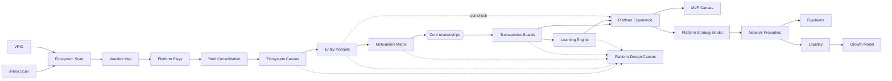

# The Platform Design Toolkit, as this project reads it

This is our working summary of the Platform Design Toolkit (PDT) 2.2 by Boundaryless. The meta-model
in [`meta-model.md`](meta-model.md) and the `pdt42 guide` command are built on it. It is written in our own
words and points to the originals, which remain the authoritative source:

- [PDT overview](https://docs.boundaryless.io/methodology/legacy/pdt) and its three guides:
  [Opportunity Exploration](https://docs.boundaryless.io/methodology/legacy/pdt/exploration) (v1.1, 2022),
  [Strategy Design](https://docs.boundaryless.io/methodology/legacy/pdt/design) (v2.2.1, 2021),
  [Growth & Product](https://docs.boundaryless.io/methodology/legacy/pdt/growth) (v1.0, 2022)
- the [canvas library](https://docs.boundaryless.io/methodology/canvases)

The PDT canvases and guides are © Boundaryless SRL, released under
[CC BY-SA 4.0](https://creativecommons.org/licenses/by-sa/4.0/). Boundaryless's modern pipelines and
techniques are all rights reserved; this summary does not draw on them.

---

## 1. The stance: design _for_ an ecosystem

- **Outside-in.** The strategy lives in the ecosystem, not inside the organisation that shapes it.
  You cannot design a platform for an ecosystem that does not exist yet. "Exists" means entities
  are already trying to create and exchange value, even if clumsily.
- **Two contexts** lead teams to platform thinking. _Ecosystem mobilisation_ organises an existing
  ecosystem that performs below its potential. _Product & service innovation_ moves an existing
  offering up the value chain by organising the ecosystem that already uses it. Most real cases mix
  both, plus the organisation itself as a network.
- **Start narrow and iterate.** The scope is boundless, so each iteration focuses on a few points
  of view: one core entity and one to three relationships.

## 2. Who is in the ecosystem: entities and roles

An **entity** is any actor with objectives: a person, team, organisation or institution. Designers
**cluster** similar entities into **entity-roles** (a GP and a nurse become "healthcare
professionals"). Losing detail is deliberate, because a loosely defined role lets more of the
ecosystem take part.

Every entity-role plays one of five **platform roles**, arranged by how strategically close they are
to the owner:

| Group  | Role                    | Code | In one line                                                                                                                    |
| ------ | ----------------------- | ---- | ------------------------------------------------------------------------------------------------------------------------------ |
| Impact | Platform owner / shaper | PO   | Holds the vision; makes sure the strategy exists and evolves. Not necessarily the owner of the infrastructure.                 |
| Impact | External stakeholder    | ES   | Cares about the whole system (regulation, externalities, governance, distribution) rather than single interactions.            |
| Demand | Peer consumer           | PC   | Consumes the value created on the platform; can leave easily.                                                                  |
| Supply | Peer producer           | PP   | Produces value, often occasionally, and wants to become more professional. May also consume.                                   |
| Supply | Partner                 | PA   | A professional producer in a stronger, more strategic relationship with the owner; often premium or niche; sometimes a broker. |

Two rules of thumb from the guide:

- At most **five** entity-roles in the peer spectrum (PC/PP/PA).
- Ask "how many of them are there?" If you can name only one or two, they are probably stakeholders
  or partners, not peers.

## 3. The two engines

A platform strategy is the combination of two engines:

- **Transactions engine.** Channels and contexts that lower the cost of interacting, so that
  smaller, more niche exchanges become worthwhile. Transactions happen _between entities_.
- **Learning engine.** Support services through which the owner helps entities learn, improve and
  evolve in a volatile world. The platform's promise is that you learn faster _inside_ than
  _outside_. Services go _from the platform to entities_.

A **platform experience** is assembled from bricks of both engines: peer-to-peer transactions,
learning services, and complementary services.

## 4. The process

The PDT runs in four macro-phases. The toolkit covers three of them with guides:

```
Exploration ──▶ Strategy Design ──▶ Validation & Prototyping ──▶ Growth
"Is there an     "How do we design     (MVP, interviews)            "How do we launch
 opportunity?"    the platform?"                                     and scale it?"
```

### 4.1 Exploration: finding the platformization space

The fractal: **ecosystem → arenas → steps**. That is hundreds of entities, then about ten per arena,
then two to five per step.

| #   | Step                                                         | Canvas                             | Produces                                                                                                                                                                                                                                                                          |
| --- | ------------------------------------------------------------ | ---------------------------------- | --------------------------------------------------------------------------------------------------------------------------------------------------------------------------------------------------------------------------------------------------------------------------------- |
| E1  | Identify the ecosystem and its arenas                        | Arena Scan                         | Arenas, meaning clusters of _systemic_ jobs-to-be-done that several entities reach together. Laid out before/after (sequence) and enabling/enabled (layer), with a FOCUS zone for the arenas you can act on. Each focus arena is broken into steps.                               |
| E2  | Scan the ecosystem                                           | Ecosystem Scan                     | The existing experiences (steps) and the entities involved, placed on three market layers: **long tail** (niche producers and consumers), **aggregators** (brokers, mediators, trusted advisors) and **infrastructures** (commodities, building blocks).                          |
| E3  | Identify leverageable assets and moats                       | VRIO + Ecosystem Scan              | Your assets that pass the ordered test Valuable → Rare → Inimitable → Organised, plus **moats**: established demand or supply aggregators and regulated players.                                                                                                                  |
| E4  | Choose the arena to focus on                                 | (Arena Scan)                       | One arena, chosen on leverageable assets, absence of moats (especially at the aggregator layer), strategic interest and addressable market.                                                                                                                                       |
| E5  | Map the value chain                                          | Wardley Map                        | User need at the top; components by visibility (Y) and evolution (X: genesis, custom, product, commodity). Components are unbundled into atoms. An industrial chain shows a **C shape**.                                                                                          |
| E6  | Apply the six Platform Plays                                 | Platform Plays                     | The to-be chain (a **Z shape**): PP1 personalisation for users, PP2 producers on top, PP3 standardised transactions, PP4 business process as SaaS, PP5 identity, reputation and trust, PP6 aggregated demand. Output: transactions to standardise and traits of the product side. |
| E7  | Identify the platformization space and consolidate the brief | Brief Consolidation, Pattern Cards | A focused space around a **core two-sided relationship**, what-if scenarios from the twelve Patterns of Platformization, and the entities that seed the Ecosystem Canvas.                                                                                                         |

### 4.2 Strategy Design: the eight steps

| #   | Step                                          | Canvas                                    | Produces                                                                                                                                                                                                                                                                                                                                                                                                            |
| --- | --------------------------------------------- | ----------------------------------------- | ------------------------------------------------------------------------------------------------------------------------------------------------------------------------------------------------------------------------------------------------------------------------------------------------------------------------------------------------------------------------------------------------------------------- |
| D1  | Map the ecosystem                             | Ecosystem Canvas                          | Entities clustered into entity-roles, placed as PO / ES / PC / PP / PA.                                                                                                                                                                                                                                                                                                                                             |
| D2  | Portray entity-roles                          | Entity-Role Portrait                      | Per role: **potential** (assets, capabilities), **compressors** (current goals, performance pressures), **gains sought**. Gains come in three kinds: _convenience_ (easier, faster, cheaper), _access & reach_ (their "other half of the apple") and _value_ (money, recognition, knowledge…). Map what they seek _today_, not what you plan to offer. Start from potential.                                        |
| D3  | Analyse the motivations to exchange value     | Motivations Matrix                        | Row "gives to" column, for every pair, current and potential. Different types first, then the diagonal (same-type peers). Always map money, reputation and feedback. Empty cells are a signal too.                                                                                                                                                                                                                  |
| D4  | Choose the core relationships                 | —                                         | One to three key relationships (a triangle works well) and one **core entity** whose point of view comes first. Every chosen entity needs a portrait.                                                                                                                                                                                                                                                               |
| D5  | Identify elementary transactions and channels | Transactions Board (one per relationship) | Atomic, verb-shaped transactions. For each: direction, whether it **already happens**, the **currency or value unit**, the **channel components**, and how the channel **reduces transaction cost**. A channel is anything that makes an interaction easier: an app, an event, a template, a contract.                                                                                                              |
| D6  | Design the learning engine                    | Learning Engine Canvas                    | Per entity-role: **entry points**, then three stages (**onboarding**, **getting better**, **catching the new opportunity**), each with key **challenges** and the **services** that meet them. Also paths between roles (consumer to producer, producer to partner): an internal growth engine.                                                                                                                     |
| D7  | Assemble platform experiences                 | Platform Experience Canvas                | A named experience from the **core role's** point of view. **Steps** assembled from transactions (entity to entity), learning services (platform to entity) and other services, laid out along **channels / touchpoints**. Also the **value proposition** for the core role and, last, the **business model**: platform activities, resources and components, value provided and cost, value captured and revenues. |
| D8  | Set up the Minimum Viable Platform            | MVP Canvas                                | The experiences in the MVP, the **MVP base** (what you already have) and how it is implemented (concierge, Wizard of Oz…). Then the key assumptions (list them all first, _then_ pick the riskiest). Always test **business model**, **trust** and **attraction** assumptions, each with how the MVP tests it and an unbiased validation criterion.                                                                 |

The **Platform Design Canvas** is a one-sheet dashboard over steps D1–D6. Its areas are owners,
stakeholders, enabling services (to partners), empowering services (to peer producers), other
services (to peer consumers), core and ancillary value propositions, infrastructures and core
components, transactions, channels and contexts, partners, peer producers and peer consumers.

### 4.3 Growth: from validated experience to liquid network

| #   | Step                              | Canvas                              | Produces                                                                                                                                                                                                                                                                                                                                              |
| --- | --------------------------------- | ----------------------------------- | ----------------------------------------------------------------------------------------------------------------------------------------------------------------------------------------------------------------------------------------------------------------------------------------------------------------------------------------------------- |
| G1  | Frame the Platform Strategy Model | Platform Strategy Model             | Up to three value-proposition elements: a **product / service bundle** for a core customer, one or more **marketplaces** (who meets whom, exchanging what), an **extension platform** (third parties extending the bundle). Missing ones are marked "not present".                                                                                    |
| G2  | Characterise the network          | Network Properties & NFX            | Seven properties **of the core relationship**: supply commoditised or differentiated; symmetric or asymmetric; local, regional or global; single or multi-tenancy; transaction frequency and lifetime; transaction value; monogamous or polygamous. From these, the expected network-effect curve (S-curve, asymptotic?) and matching growth tactics. |
| G3  | Sketch the flywheels              | Flywheel Sketching + Flywheel Cards | One core network-effect flywheel (direct or indirect), then two or three reinforcing ones: economies of scale, brand, proprietary tech, data, lock-in. Find the bottleneck.                                                                                                                                                                           |
| G4  | Plan liquidity                    | Liquidity Canvas                    | Customer alternatives, the minimum thresholds per side, the **canonical unit** (category × location) to constrain launch, and which side to start with (usually supply).                                                                                                                                                                              |
| G5  | Build the growth engine           | Growth Model (draft)                | Active growth loops (viral, paid, content/UGC, sales) with their equations and bottlenecks, cohorts and unit economics.                                                                                                                                                                                                                               |

The ten growth tactics for initial liquidity are: building trust, marquee strategy, single-user
value (SaaS), virality, nesting inside an existing platform, hyper-targeted marketing/SEO, remnant
inventory, scraping and automation, subsidising one side, and community or e-mail lists through
content.

## 5. How the canvases feed each other



## 6. What this means for a consistent model

The canvases are views over one ecosystem model. The same entity-role appears as:

- a sticky on the Ecosystem Canvas,
- a portrait,
- a row and a column of the Motivations Matrix,
- a party to transactions,
- a row of the Learning Engine,
- the core role of an experience.

That is exactly the kind of consistency a text-based, validated model can guarantee and a wall of
post-its cannot. The meta-model makes these links explicit; the canvases render them.

Each element is written once, in the home chapter of its type: the chapter of the step where the
method creates it. Later steps fill it in there or reference it, and an element discovered in a
later step is still written in its home chapter. The Ecosystem Scan (E2) maps "all the entities
involved and how these lay down on a layered market view", so entities live in E2's chapter; the
Ecosystem Canvas (D1) gives them their platform role and the portrait (D2) their context, goals and
gains, in place. A design that skips exploration still writes its entities there.
